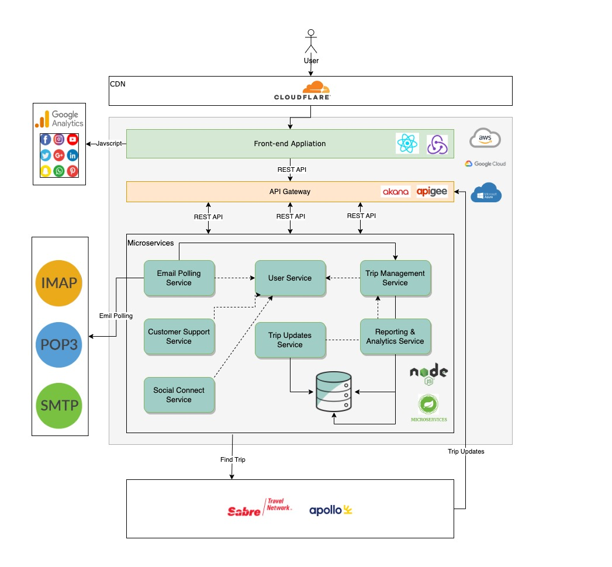
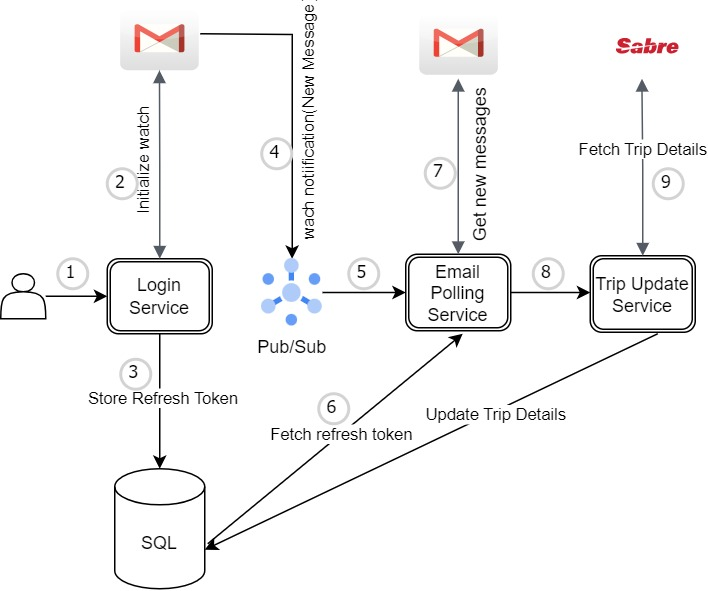

# katas-tech-power-rangers
The Road Warrior Architecture

# Table of Contents
```
I. Overview
II. Vision
III. Requirements
    1. Functional Requirements
    2. Tehcnical Requirements
IV. Architectural Characteristics
    1. Security
    2. Scalability
    3. Performance
    4. Reliability
    5. Availability
    6. Elasticity
    7. Recoverability
V. Solution
    1. Road Warrior Customer Journey
    2. Component Architecture
    3. Detailed Architecture
VI. Deep Dive On Central Elements
    1. Email Polling & Trip Update Mechanism
VII. MVP Release Plan
    Target 1. Design and Discovery
    Target 2. Building Headless System
    Target 3. Integrate with Web and App
    Target 4. Integration Testing and Launch
VIII. Architecture Decision Eecord
    ADR 1. React Native for Mobile and SPA for Web
    ADR 2. Microservices Pattern
    ADR 3. Serverless
    ADR 4. 3rd Party Analytics
    ADR 5. Database
    ADR 6. Internationalization
IX. UI Interfaces
```

## I. Overview
Introducing 'The Road Warrior' – a dynamic new startup with a vision to redefine the future of travel organization. We're embarking on a journey to craft the next-generation online trip management dashboard, offering travelers an unparalleled experience. With our innovative platform, travelers can effortlessly access and organize all their reservations, elegantly arranged by trip, accessible via the web or right in the palm of their hand on their mobile device. Our mission is to empower travelers with seamless, intuitive tools, setting the stage for a new era of stress-free and streamlined travel planning.

## II. Vision
At 'The Road Warrior,' our vision is to revolutionize the way people explore and experience the world. We envision a future where travel is not just a journey but a seamless, joyous adventure. We see a world where travelers are liberated from the hassles of disorganized bookings and can instead focus on creating unforgettable memories.

We aspire to be the beating heart of travel organization, offering a central hub where every aspect of a trip, from flights and accommodations to activities and itineraries, is effortlessly managed. We dream of a world where our platform, available both on the web and through mobile devices, serves as the indispensable companion for every traveler, guiding them through their journeys with ease and sophistication.

Our vision is to empower individuals to explore more, stress less, and make the most of their precious travel moments. We believe in a future where travel becomes a source of inspiration and connection, where people discover the beauty of the world while 'The Road Warrior' takes care of the rest. Together, we're shaping the future of travel, one trip at a time.

## III. Requirements

### Functional Requirements

#### Customer Flow 1: User Registration and Onboarding
* User visits the startup's website or mobile app.
* User clicks on the "Sign Up" or "Create Account" button.
* User provides their email address to register.
* The system sends a verification email to the user's provided email address.
* User verifies their email by clicking on the link in the email.
* User completes their profile by adding their name, contact information, and a profile picture (optional).
* User is now onboarded and can start using the trip management dashboard.

#### Customer Flow 2: Polling and Filtering Emails
* User logs into the dashboard.
* User accesses the email integration feature.
* The system starts polling the user's email inbox for travel-related emails.
* User sets up filters to whitelist certain emails (e.g., confirmation emails from airlines, hotels, and car rental agencies).
* The system filters and organizes these emails, displaying them in the dashboard.

#### Customer Flow 3: Automatic Updates
* User logs into the dashboard.
* User views their upcoming trips.
* The system interfaces with airline, hotel, and car rental systems to monitor travel details.
* If there are updates (e.g., delays, cancellations, gate changes), the system updates the trip details in real-time.
* Updates are reflected in the dashboard within 5 minutes, ensuring timely information for the user.

#### Customer Flow 4: Manual Reservation Management
* User logs into the dashboard.
* User accesses the "Manage Reservations" section.
* User can manually add, update, or delete existing reservations.
* User inputs relevant details such as flight numbers, hotel bookings, and car rentals.
* Changes made by the user are saved and reflected in the dashboard.

#### Customer Flow 5: Trip Organization and Completion
* User logs into the dashboard.
* User views their trips, which are organized by upcoming and past trips.
* Once a trip is completed, the system automatically removes the trip and associated details from the dashboard.

#### Customer Flow 6: Sharing Trip Information
* User logs into the dashboard.
* User selects a specific trip they want to share.
* User clicks on the "Share Trip" button.
* The system provides options to interface with standard social media sites or share with specific individuals.
* User shares their trip information with the desired audience.

#### Customer Flow 7: Rich User Interface
* User accesses the dashboard from various deployment platforms (web and mobile).
* The dashboard provides a visually appealing and user-friendly interface across all devices.
* Users can easily navigate, view, and interact with their trip details.

#### Customer Flow 8: End-of-Year Summary Reports
* User logs into the dashboard.
* User accesses the "Reports" or "Analytics" section.
* The system generates end-of-year summary reports with various travel metrics (e.g., travel trends, locations visited, vendor preferences, cancellations, and updates).
* Users can view, download, or share these reports for their travel analysis.

#### Customer Flow 9: Data Gathering for Travel Analytics
* As users continue to use the dashboard for trip management, the system gathers analytical data from their trips.
* This data is used for various purposes, including identifying travel trends, preferences, and analyzing the frequency of cancellations and updates.
* The startup can use this data for business intelligence and improving the user experience.
* These customer flows outline how users interact with the startup's online trip management dashboard, ensuring a seamless and feature-rich experience for travelers.

### Technical Requirements

* User Authentication: Implement secure user authentication mechanisms, such as multi-factor authentication (MFA) and OAuth.
* Data Encryption: Encrypt sensitive user data, both in transit and at rest, using industry-standard encryption protocols.
* API Security: Secure API endpoints with proper authentication and authorization mechanisms.
* Load Balancing: Implement load balancing to distribute traffic evenly across multiple server instances.
* Auto-Scaling: Configure auto-scaling to dynamically adjust resources based on traffic demands.
* Database Optimization: Optimize database queries and indexing for efficient data retrieval.
* Front-End Optimization: Minimize page load times and optimize front-end code for speed.
* Redundancy: Set up redundant systems to ensure continuous operation in case of hardware or software failures.
* Monitoring: Implement real-time monitoring and alerting to detect and address issues promptly.
* Failover Mechanisms: Establish failover mechanisms for critical components to minimize downtime.
* High Availability Architecture: Design the system with high availability in mind, minimizing single points of failure.
* Geographical Distribution: Use geographical redundancy across data centers or regions to enhance availability.
* Resource Scaling: Dynamically scale resources up or down based on demand, ensuring optimal resource utilization.
* Horizontal Scaling: Scale by adding more servers or containers to handle increased load.
* Vertical Scaling: Increase the capacity of individual resources (e.g., upgrading server configurations).
* Data Backup: Implement regular automated data backup procedures to prevent data loss.
* Disaster Recovery Plan: Develop and test a comprehensive disaster recovery plan.

## Architectural Characteristics
The key properties and features that describe the design and behavior of The Road Warrior

#### Security:
Why Chosen: Security is of paramount importance because the application will handle sensitive user data, including personal information and travel details. Travelers need assurance that their data will be protected from unauthorized access, breaches, and cyber threats. Implementing robust security measures is essential to build trust and ensure compliance with data protection regulations.

#### Scalability:
Why Chosen: Scalability is critical because your MVP aims to serve 2 million active users per week out of a total of 15 million users. To accommodate rapid user growth and varying levels of traffic, a scalable architecture is necessary. It ensures that the system can handle increased loads without performance degradation or downtime, providing a smooth user experience.

#### Performance:
Why Chosen: Performance directly impacts user satisfaction. Travelers expect a responsive and fast application when managing their trips. Implementing performance optimization measures, such as caching, CDN usage, and efficient database queries, ensures that the system delivers quick response times, even during peak usage periods.

#### Reliability:
Why Chosen: Reliability is crucial because travelers rely on the system to access their travel information, which can be time-sensitive. Unreliable systems can lead to frustration and disruptions in travel plans. Redundancy, failover mechanisms, and real-time monitoring ensure that the system remains available and dependable.

#### Availability:
Why Chosen: Availability is key to providing uninterrupted service to users. Travel management can happen at any time, and downtime can lead to inconvenience for travelers. High availability architecture, geographical redundancy, and adherence to service level agreements (SLAs) ensure that the system is accessible when users need it.

#### Elasticity:
Why Chosen: Elasticity complements scalability by allowing the system to adapt to changing demands in real-time. It ensures efficient resource allocation and cost optimization. Elasticity enables the system to handle sudden traffic spikes without overprovisioning, which can be cost-effective in a dynamic environment.

#### Recoverability:
Why Chosen: Recoverability is essential to minimize data loss and downtime in case of unexpected events, such as hardware failures, natural disasters, or cyberattacks. Data backup, disaster recovery planning, and backup systems provide a safety net to quickly restore operations and minimize disruptions.

## Solution

### Road Warrior Customer Interaction
Here is a list of customer interaction components.


### System Level Architecture

Fill the data
### Detailed Architecture

Fill the data


## Deep Dive On Central Elements

### Email Polling & Trip Update Mechanism



Summary:
1.	User sign up with google account 
2.	User provides consent to watch emails.
3.	Store refresh token in database, which will be used for fetching emails when new email is notified.
4.	Watch notification received on new email.
5.	Email polling service receives the message id.
6.	Email polling service fetches refresh token from database.
7.	Email polling service fetches email from gmail using refresh token and process for confirmation id.
8.	Send confirmation id to trip update service.
9.	Trip update service make call Sabre/Apollo for trip details.
10.	Stores trip details in database

## MVP Release Plan

Here is a list of targets to achieve for the MVP release.

### Target 1. Design and Discovery:
* User Research: Begin by conducting user research to understand the needs and preferences of your target audience.
* User Stories: Create user stories and prioritize features based on user feedback and business goals.
* Design Prototypes: Develop wireframes and prototypes to visualize the user interface.
* Usability Testing: Conduct usability testing to gather user feedback and refine the design.

### Target 2. Building Headless System:
* Backend Development: Build the headless backend system that handles data storage, email integration, API connections, and business logic.
* Database Setup: Set up the database architecture to store user accounts, reservations, and other relevant data.
* Email Integration: Develop the email polling and filtering system.
* API Integration: Integrate with airline, hotel, and car rental APIs for real-time updates.

### Target 3. Integrate with Web and App:
* Web Development: Develop the web application, ensuring it is responsive and user-friendly.
* Mobile App Development: Create mobile apps (iOS and Android) that provide a consistent user experience.
* API Development: Build APIs to enable communication between the front-end (web and mobile) and the headless backend.

### Target 4. Integration Testing and Launch:
* Integration Testing: Thoroughly test the system to ensure all components work together seamlessly. This includes testing API integrations, email processing, and data synchronization.
* User Acceptance Testing (UAT): Invite a group of users to participate in UAT to identify any usability issues or bugs.
* Performance Testing: Assess the system's performance under load to ensure it can handle the expected user base.
* Security Testing: Conduct security testing to identify and address vulnerabilities.
* Beta Testing: Release a beta version to a limited user group to gather feedback.
* Bug Fixing: Address any issues identified during testing.
* Launch: Once testing is successful and the system is stable, launch the MVP to the broader user base.

## Architecture Decision Records

### ADR 1: React Native for Mobile and SPA for Web
- Decision: Use React Native for mobile app development and a Single Page Application (SPA) architecture for the web application.
- Rationale: React Native offers a rich user interface and enables code reuse across platforms. SPA architecture provides a smooth user experience.

### ADR 2. Microservices Pattern
- Decision: Microservices pattern as the foundation for our architecture.
- Rationale: Independently deployable each service typically has its own source code repository and its own deployment pipeline, which builds, tests and deploys the service.This pattern was chosen to ensure that our architecture is well-structured, scalable, and easy to manage.

### ADR 3. Serverless
- Decision: To adopt serverless computing as an architectural approach for developing and deploying components of our applications.
- Rationale: Adoption of serverless computing reduces infrastructure management overhead, achieving auto-scalability, and optimizing costs. It allows us to focus on code development while the cloud provider manages infrastructure scaling and availability.

### ADR 4. 3rd Party Analytics
- Decision: To integrate third-party analytics services, specifically Google Analytics, into our application architecture.
- Rationale: Integrating a third-party analytics service allows us to gain deep insights into our application's performance and user behavior. It enables travel agencies and airline, hotel, and car rental companies to respond to issues in real-time, enables them to plan their marketing strategies and offer the customers better experience.

### ADR 5. Database
- Decision: We have decided to use MySQL as the RDBMS for the project.
- Rationale: We chose this type of database because our project's data structure is well-suited to tabular, structured data.MySQL provides strong ACID (Atomicity, Consistency, Isolation, Durability) compliance, which is crucial for maintaining data integrity, consistency, and transactional reliability. MySQL offers scalability options, including the ability to horizontally scale through sharding or clustering to accommodate increased data volumes and user loads.

### ADR 6. Internationalization
- Decision: Internationalization is crucial to ensure that the application is accessible and user-friendly for a global audience.
- Rationale: It enables users from different regions to interact with the application in their preferred language and format. We will determine the user's preferred language based on browser settings or user preferences collected during user registration. This will ensure that users are presented with content in their preferred language by default. To handle locale-specific date, time, currency, and numeric formatting, we will utilize the localization features provided by i18next and ResourceBundle. This will ensure that data is presented correctly based on the user's locale.

## IX. UI Interfaces

Desktop             |  Mobile
:-------------------------:|:-------------------------:
 |  
