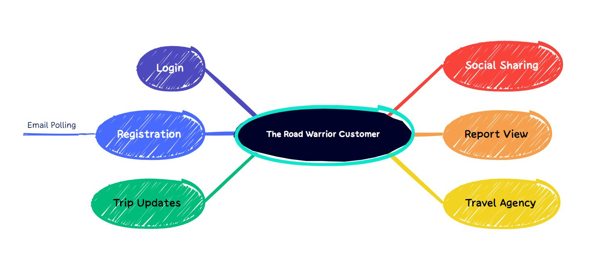

# katas-tech-power-rangers
The Road Warrior Architecture

# Table of Contents
```
I. Overview
II. Vision
III. Requirements
    1. Functional Requirements
    2. Tehcnical Requirements
IV. Architectural Characteristics
    1. Security
    2. Scalability
    3. Performance
    4. Reliability
    5. Availability
    6. Elasticity
    7. Recoverability
V. Solution
    1. Road Warrior Customer Journey
    2. Component Architecture
    3. Integrated Architecture
    4. Physical Architecture
VI. Deep Dive On Central Elements
    1. Email Polling Mechanism
    2. Trip Update Service
    3. Trip Views
VII. MVP Release Plan
  Target 1. Marketing and Analytics
  Target 2. Mobile App Menu
  Target 3. Mobile App Orders
  Target 4. Web Orders
VIII. Architecture Decision Eecord
  ADR 1. Microservices Pattern
  ADR 2. Serverless
  ADR 3. 3rd Party Analytics
  ADR 4. Trip Update Service
  ADR 5. Database
  ADR 6. Caching
  ADR 7. Customer Suppoert as Service
```

## I. Overview
Introducing 'The Road Warrior' – a dynamic new startup with a vision to redefine the future of travel organization. We're embarking on a journey to craft the next-generation online trip management dashboard, offering travelers an unparalleled experience. With our innovative platform, travelers can effortlessly access and organize all their reservations, elegantly arranged by trip, accessible via the web or right in the palm of their hand on their mobile device. Our mission is to empower travelers with seamless, intuitive tools, setting the stage for a new era of stress-free and streamlined travel planning.

## II. Vision
At 'The Road Warrior,' our vision is to revolutionize the way people explore and experience the world. We envision a future where travel is not just a journey but a seamless, joyous adventure. We see a world where travelers are liberated from the hassles of disorganized bookings and can instead focus on creating unforgettable memories.

We aspire to be the beating heart of travel organization, offering a central hub where every aspect of a trip, from flights and accommodations to activities and itineraries, is effortlessly managed. We dream of a world where our platform, available both on the web and through mobile devices, serves as the indispensable companion for every traveler, guiding them through their journeys with ease and sophistication.

Our vision is to empower individuals to explore more, stress less, and make the most of their precious travel moments. We believe in a future where travel becomes a source of inspiration and connection, where people discover the beauty of the world while 'The Road Warrior' takes care of the rest. Together, we're shaping the future of travel, one trip at a time.

## III. Requirements

### Functional Requirements

#### Customer Flow 1: User Registration and Onboarding
* User visits the startup's website or mobile app.
* User clicks on the "Sign Up" or "Create Account" button.
* User provides their email address to register.
* The system sends a verification email to the user's provided email address.
* User verifies their email by clicking on the link in the email.
* User completes their profile by adding their name, contact information, and a profile picture (optional).
* User is now onboarded and can start using the trip management dashboard.

#### Customer Flow 2: Polling and Filtering Emails
* User logs into the dashboard.
* User accesses the email integration feature.
* The system starts polling the user's email inbox for travel-related emails.
* User sets up filters to whitelist certain emails (e.g., confirmation emails from airlines, hotels, and car rental agencies).
* The system filters and organizes these emails, displaying them in the dashboard.

#### Customer Flow 3: Automatic Updates
* User logs into the dashboard.
* User views their upcoming trips.
* The system interfaces with airline, hotel, and car rental systems to monitor travel details.
* If there are updates (e.g., delays, cancellations, gate changes), the system updates the trip details in real-time.
* Updates are reflected in the dashboard within 5 minutes, ensuring timely information for the user.

#### Customer Flow 4: Manual Reservation Management
* User logs into the dashboard.
* User accesses the "Manage Reservations" section.
* User can manually add, update, or delete existing reservations.
* User inputs relevant details such as flight numbers, hotel bookings, and car rentals.
* Changes made by the user are saved and reflected in the dashboard.

#### Customer Flow 5: Trip Organization and Completion
* User logs into the dashboard.
* User views their trips, which are organized by upcoming and past trips.
* Once a trip is completed, the system automatically removes the trip and associated details from the dashboard.

#### Customer Flow 6: Sharing Trip Information
* User logs into the dashboard.
* User selects a specific trip they want to share.
* User clicks on the "Share Trip" button.
* The system provides options to interface with standard social media sites or share with specific individuals.
* User shares their trip information with the desired audience.

#### Customer Flow 7: Rich User Interface
* User accesses the dashboard from various deployment platforms (web and mobile).
* The dashboard provides a visually appealing and user-friendly interface across all devices.
* Users can easily navigate, view, and interact with their trip details.

#### Customer Flow 8: End-of-Year Summary Reports
* User logs into the dashboard.
* User accesses the "Reports" or "Analytics" section.
* The system generates end-of-year summary reports with various travel metrics (e.g., travel trends, locations visited, vendor preferences, cancellations, and updates).
* Users can view, download, or share these reports for their travel analysis.

#### Customer Flow 9: Data Gathering for Travel Analytics
* As users continue to use the dashboard for trip management, the system gathers analytical data from their trips.
* This data is used for various purposes, including identifying travel trends, preferences, and analyzing the frequency of cancellations and updates.
* The startup can use this data for business intelligence and improving the user experience.
* These customer flows outline how users interact with the startup's online trip management dashboard, ensuring a seamless and feature-rich experience for travelers.

### Technical Requirements
*
*
*
*
*
*
## Architectural Characteristics
The key properties and features that describe the design and behavior of The Road Warrior

### Security 
Fill the data
### Scalability
Fill the data
### Performance
Fill the data
### Reliability
Fill the data
### Availability
Fill the data
### Elasticity
Fill the data
### Recoverability
Fill the data

## Solution

### Road Warrior Customer Interaction



### Component Architecture
Fill the data
### Integrated Architecture
Fill the data
### Physical Architecture
Fill the data


## Deep Dive On Central Elements

### Email Polling Mechanism
Fill the data
### Trip Update Service
Fill the data
### Trip Views
Fill the data


## MVP Release Plan
### Target 1. Marketing and Analytics
Fill the data
### Target 2. Mobile App Menu
Fill the data
### Target 3. Mobile App Orders
Fill the data
### Target 4. Web Orders


## Architecture Decision Record
Fill the data
### ADR 1. Microservices Pattern
Fill the data
### ADR 2. Serverless
Fill the data
### ADR 3. 3rd Party Analytics
Fill the data
### ADR 4. Trip Update Service
Fill the data
### ADR 5. Database
Fill the data
### ADR 6. Caching
Fill the data
### ADR 7. Internationalization